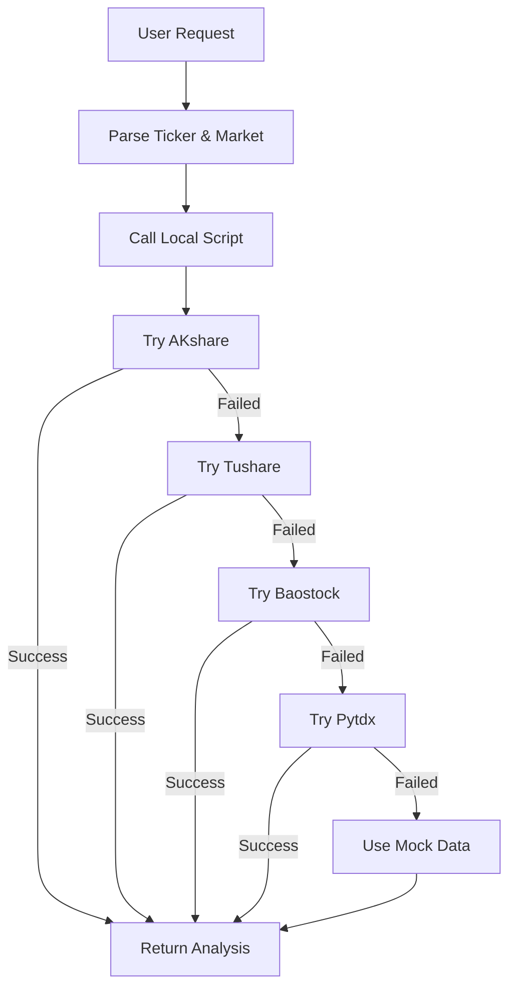

# A-Stock Analysis

Analyze stocks via comprehensive multi-source data — combining fundamental analysis, market sentiment, technical indicators, and AI reports.

## When to use

- User asks to analyze a stock ticker (US / HK / A-share)
- User asks for a stock quote, target price, risk score, or investment recommendation
- User wants a comprehensive stock analysis

## Prerequisites

- **Data Sources**: AKshare, Tushare, Baostock, Pytdx (auto-failover)
- **Python Environment**: Requires Python 3.9+ with pandas, numpy installed

## Data Sources

This skill uses multiple free data sources with automatic failover:

### Primary Data Sources

1. **AKshare** - Comprehensive market data (A-shares, HK, US)
2. **Tushare** - A-share historical data
3. **Baostock** - A-share financial data
4. **Pytdx** - Direct connection to Chinese market data

All sources are free and require no authentication.

## Analysis Framework

### Five Pillars Model

| Dimension | Components | Weight |
|-----------|-----------|--------|
| **Fundamental** | PE/PEG, growth rate, profit margin, ROE, FCF | Company health |
| **Technical** | Moving averages, RSI, MACD, Bollinger Bands, ATR | Price trends |
| **Sentiment** | Market mood, news sentiment, social media | Investor psychology |
| **Flow** | Capital flow, volume patterns, institutional activity | Money movement |
| **Valuation** | Industry comparison, historical ranges | Fair value assessment |

### Risk Assessment (0-10, additive)

| Factor | Trigger | Points |
|--------|---------|--------|
| Valuation | PE > 60 | +2.0 |
| Growth | Growth < -10% | +2.0 |
| Liquidity | Volume below threshold | +2.0 |
| Market | High volatility index | +1.5 |
| Technical | Price below MA200 | +1.0 |

Risk 0-2 → Low risk · Risk 8-10 → High risk, avoid.

### Investment Recommendation Model

Based on composite scoring from all five pillars:

| Score | Recommendation |
|-------|---------------|
| > 8 | STRONG_BUY |
| 6-8 | BUY |
| 4-6 | HOLD |
| 2-4 | AVOID |
| < 2 | STRONG_AVOID |

### Target Price Estimation

Multiple methods weighted by industry:
- PE valuation
- PEG valuation  
- Growth discount model
- DCF (Discounted Cash Flow)
- Technical analysis support/resistance

Risk adjustment applied based on risk score.

### Stop-Loss Calculation

```
stop_loss = current_price - ATR(14) × multiplier(1.5-4.0)
```
Multiplier adjusts for volatility and market conditions.

## Typical Workflow

```
1. Identify stock ticker and market (CN/HK/US)
2. Run local analysis script: python multi_source_analysis.py <TICKER> [MARKET]
3. Present: recommendation, technical indicators, risk assessment, AI insights
```

## Usage Guidelines

When presenting results to the user, highlight:
1. **Recommendation** (STRONG_BUY / BUY / HOLD / AVOID / STRONG_AVOID) + confidence
2. **Current price** vs moving averages → trend direction
3. **Risk assessment** + top risk factors
4. **Stop-loss suggestion** + method
5. **Key technical indicators** (RSI, MACD, Bollinger Bands)
6. **Investment thesis** summary

## Local Python Script

This skill uses a bundled multi-source stock analysis script as its primary analysis engine.

### Script Location

The script is located in the skill's `scripts/` directory:
```
scripts/multi_source_analysis.py
```

Full path: `/home/liangzx/python-pandora/.lingma/skills/a-stock-analysis/scripts/multi_source_analysis.py`

### Features

- **Multi-market support**: A-shares (CN), Hong Kong stocks (HK), US stocks (US)
- **4 data sources with auto-failover**: AKshare → Tushare → Baostock → Pytdx
- **Technical indicators**: MA, RSI, BOLL, MACD, ATR
- **No API key required**: Uses free public data sources
- **Auto fallback to mock data**: If all sources fail
- **Command-line interface**: Easy to use with arguments

### Prerequisites

Before using the fallback script, ensure dependencies are installed:

```bash
# Navigate to project root
cd /home/liangzx/python-pandora

# Activate virtual environment
source .venv/bin/activate

# Install required packages (if not already installed)
pip install akshare tushare baostock pytdx pandas numpy
```

### Usage

#### Method 1: Direct Command Line

```bash
# Navigate to skill scripts directory
cd /home/liangzx/python-pandora/.lingma/skills/a-stock-analysis/scripts

# Activate virtual environment
source /home/liangzx/python-pandora/.venv/bin/activate

# Analyze A-share stock (default market is CN)
python multi_source_analysis.py 300752

# Analyze with explicit market code
python multi_source_analysis.py 300752 CN    # A-share
python multi_source_analysis.py 0700.HK HK   # Hong Kong
python multi_source_analysis.py AAPL US      # US stock
```

#### Method 2: From Any Directory

```bash
# Use absolute path
cd /home/liangzx/python-pandora && source .venv/bin/activate
python .lingma/skills/a-stock-analysis/scripts/multi_source_analysis.py 300752 CN
```

### When to Use This Skill

Use this skill when:

1. ✅ **Stock analysis needed**: User wants comprehensive stock evaluation
2. ✅ **Multi-market coverage**: A-shares, HK stocks, or US stocks
3. ✅ **Technical analysis**: Need indicators like RSI, MACD, Bollinger Bands
4. ✅ **Quick analysis**: Fast technical evaluation without API latency
5. ✅ **Cost-free**: No API keys or subscriptions required
6. ✅ **Reliable**: Multiple data sources with automatic failover

### Supported Stock Formats

| Market | Format Examples | Auto-Detection |
|--------|----------------|----------------|
| **A-Share** | `300752`, `600519`, `300752.SZ`, `600519.SS` | ✅ Yes |
| **Hong Kong** | `0700.HK`, `9988.HK`, `0700` | ✅ Yes |
| **US Stock** | `AAPL`, `TSLA`, `NVDA`, `MSFT` | ✅ Yes (with market=US) |

### Output Format

The script provides a comprehensive technical analysis report:

**1. Price & Moving Averages**
- Current price with currency symbol (¥/HK$/\$)
- MA5, MA20, MA60 with trend arrows (↑/↓)

**2. RSI (Relative Strength Index)**
- 14-period RSI value
- Status: Overbought (>70) ⚠️ / Oversold (<30) ✅ / Neutral

**3. Bollinger Bands**
- Upper/Middle/Lower bands
- Price position percentage (0%-100%)
- Signal: Breakout above/below bands

**4. MACD (Moving Average Convergence Divergence)**
- DIF, DEA, Histogram values
- Trend signal: Bullish 📈 / Bearish 📉
- Momentum analysis (red/green bars)

**5. ATR (Average True Range)**
- 14-period ATR value
- Suggested stop-loss levels (1.5x and 2x ATR)

**6. Investment Recommendation**
- Composite score based on multiple indicators
- Clear signal: BUY / HOLD / AVOID
- Confidence level

### Integration Workflow



### Sample Output

```
======================================================================
  300752.CN 技术分析报告
  数据源: Baostock
  分析时间: 2026-04-20 22:03:51
======================================================================

【价格与均线】
----------------------------------------------------------------------
当前价格: ¥19.33
MA5:  ¥19.20  ↑
MA20: ¥17.20  ↑
MA60: ¥18.40  ↑

【RSI指标】
----------------------------------------------------------------------
RSI(14): 76.44
状态: ⚠️ 超买区

【布林带 BOLL】
----------------------------------------------------------------------
上轨: ¥19.86
中轨: ¥17.20
下轨: ¥14.55
价格位置: 90.0%
信号: 📈 中轨上方

【MACD指标】
----------------------------------------------------------------------
DIF: 0.3051
DEA: -0.1091
MACD柱: 0.4142
信号: 📈 多头市场

【ATR波动率】
----------------------------------------------------------------------
ATR(14): ¥0.74
建议止损: ¥17.85

======================================================================
【投资建议】
======================================================================
💡 建议: HOLD (观望)

⚠️ 免责声明: 仅供参考，不构成投资建议
======================================================================
```

---

*Powered by open-source financial data libraries - Free, reliable stock analysis for traders and AI agents.*
